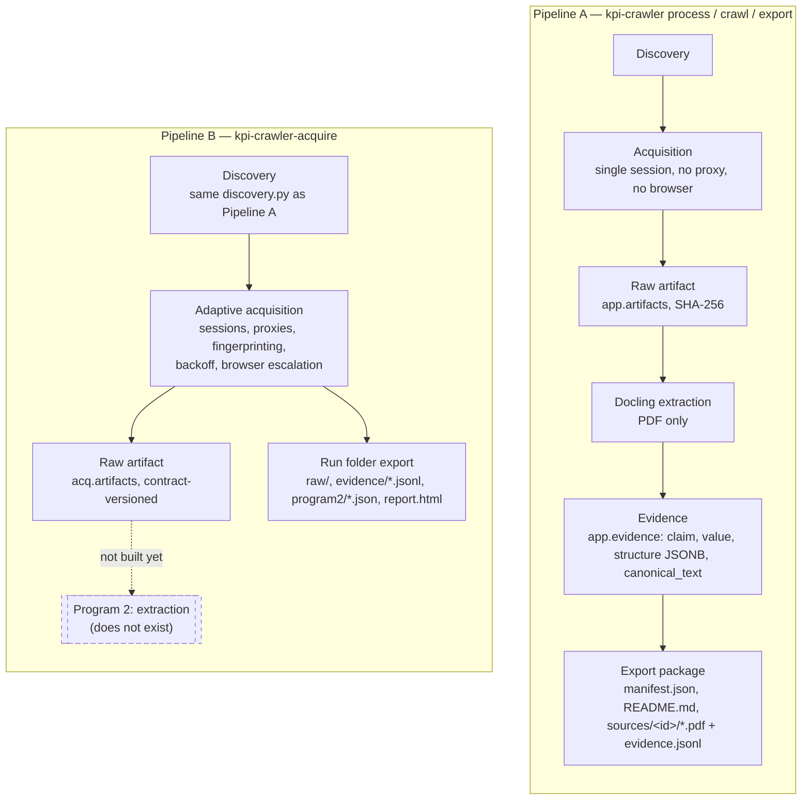
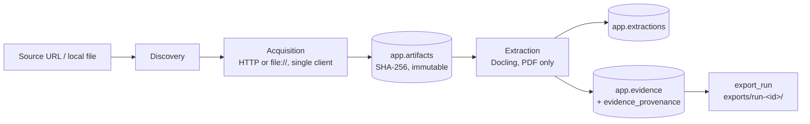
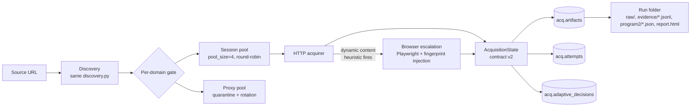

# KPI Crawler

A generalized, source-agnostic evidence-acquisition platform for institutional benchmarking. It discovers and acquires web resources (and local files), preserves raw artifacts with strict provenance, and — for the subset of content it currently extracts from — turns them into structured evidence.

This repo currently contains **two separate, non-integrated pipelines**, plus a standalone retrieval benchmark. They share a discovery layer and a database, but nothing else. Knowing which one you're running matters: **only one of them extracts anything**.

---

## Table of Contents

- [The two pipelines, at a glance](#the-two-pipelines-at-a-glance)
- [Pipeline A — kpi-crawler (simple pipeline: acquire → extract → evidence)](#pipeline-a--kpi-crawler-simple-pipeline-acquire--extract--evidence)
- [Pipeline B — kpi-crawler-acquire (adaptive engine: acquisition only)](#pipeline-b--kpi-crawler-acquire-adaptive-engine-acquisition-only)
- [Pipeline C — kpi-crawler-retrieval (standalone benchmark)](#pipeline-c--kpi-crawler-retrieval-standalone-benchmark)
- [Artifact Viewer & Exporter (viewer.sh)](#artifact-viewer--exporter-viewersh)
- [What neither pipeline covers (explicit boundaries)](#what-neither-pipeline-covers-explicit-boundaries)
- [Setup & Requirements](#setup--requirements)
- [Configuration](#configuration)
- [Testing](#testing)
- [Project Layout](#project-layout)

---

## The two pipelines, at a glance



Pipeline A is simple and single-threaded, but it is the **only one that extracts anything**. Pipeline B is the sophisticated one (sessions, proxy rotation, fingerprinting, adaptive backoff) but **only fetches** — its own migration explicitly describes its schema as something a future, separate Program 2 will read, *"not app.\* or this engine's internals."* No evidence, table, or KPI value exists anywhere in this repo yet from a Pipeline B run.

| Feature | Pipeline A | Pipeline B |
|---|---|---|
| **Command** | `kpi-crawler process` \| `crawl` \| `export` | `kpi-crawler-acquire` |
| **Schema** | `app.*` | `acq.*` |
| **Extracts content?** | **Yes** (PDF, via Docling) | **No** — acquisition only |
| **Sessions / proxies / fingerprinting / adaptive backoff** | No | **Yes** |
| **Failure model** | Exception classes + DB event rows | Closed `AcquisitionState` enum (contract-versioned) |
| **Output** | DB rows + `exports/run-<id>/` on request | Self-contained `.data/runs/<site>/<run_id>/` every run |

Both share the same `discovery.py` (link/sitemap/robots parsing) and the same `kpi-crawler migrate` command (one migration runner, both schemas).

---

## Pipeline A — kpi-crawler (simple pipeline: acquire → extract → evidence)



### Commands

```bash
uv run kpi-crawler start                  # validate DB connection + config
uv run kpi-crawler migrate                # apply all pending migrations (both schemas)
uv run kpi-crawler process <url-or-path>  # acquire + extract a single resource end-to-end
uv run kpi-crawler crawl <url>            # bounded breadth-first crawl, then extract each PDF found
uv run kpi-crawler export <run-id>        # write a portable exports/run-<id>/ directory
```

### What it does

| Capability | Status | Notes |
|---|---|---|
| HTTP/HTTPS + file:// acquisition | Yes | Single client, no session/proxy concept |
| Discovery: links, sitemaps, robots.txt sitemap directives, `rel="next"` pagination | Yes | Shared `discovery.py` — same code Pipeline B uses |
| Non-page link filtering | Yes | `<link rel="stylesheet"\|"icon"\|"preload"\|...>` excluded from the crawl frontier (standards-based `rel`, never a filename guess) |
| Content-addressed storage | Yes | SHA-256; identical bytes stored once, extracted once |
| Immutability | Yes | DB triggers reject `UPDATE`/`DELETE` on `app.artifacts` |
| Retry / timeout / size bounds | Yes | `ACQUISITION_RETRIES`, `ACQUISITION_TIMEOUT_SECONDS`, `MAX_ARTIFACT_BYTES` |
| Crawl depth / artifact caps | Yes | `CRAWL_MAX_DEPTH`, `CRAWL_MAX_ARTIFACTS` |
| PDF extraction (Docling) | Yes | Only `application/pdf` by default (`ALLOWED_CONTENT_TYPES`) |
| Evidence types | Yes | `text`, `table`, `visual` (`app.evidence.evidence_type`) |
| Structural metadata | Yes | structure JSONB per evidence row — page geometry / bounding boxes where Docling provides them |
| Canonical text | Yes | Versioned deterministic serialization (`canonical_text`, `canonical_serializer_version`) |
| Failure persistence | Yes | Failed/rejected acquisitions recorded, not silently dropped |
| Export package | Yes | `manifest.json`, `README.md`, `sources/<artifact_id>/{original.*, evidence.jsonl, source.json}` — no `report.html`, that only exists in Pipeline B |
| Sessions, proxies, fingerprinting, browser escalation, adaptive backoff | No | Pipeline B only |

---

## Pipeline B — kpi-crawler-acquire (adaptive engine: acquisition only)



### Commands

```bash
uv run kpi-crawler-acquire <url>
uv run kpi-crawler-acquire --verbose <url>                                     # per-attempt session/proxy/fingerprint detail
uv run kpi-crawler-acquire --max-depth 2 --max-artifacts 50 --max-concurrency 8 <url>
uv run kpi-crawler-acquire --no-browser <url>                                  # HTTP only, no Playwright escalation
```

### What it does

| Capability | Status | Notes |
|---|---|---|
| Discovery | Yes | Same `discovery.py` as Pipeline A |
| Adaptive concurrency + backoff | Yes | Reduces concurrency on HTTP 429, restores after a healthy streak |
| Session lifecycle | Yes | Per-domain pool (`pool_size=4`), round-robin reuse, retires on real failures |
| 404 does not penalize session/proxy health | Yes | `AcquisitionState.NOT_FOUND` (contract v2) is excluded from `report_failure()` — a missing resource isn't a broken identity, unlike `ACCESS_DENIED`/`NETWORK_ERROR`/`TIMEOUT`, which still count |
| Proxy pool | Yes | Round-robin, health tracking, quarantine + recovery |
| Browser escalation | Yes | Playwright headless Chromium when `dynamic_content_likely` heuristic fires on a fetched page (script-to-content ratio) — not triggered by a blocked/failed request, since escalation only runs after a successful HTTP fetch |
| Fingerprint injection & consistency | Yes | Crawlee `DefaultFingerprintGenerator` + `browserforge`; one fingerprint per session, reused across that session's pages |
| Non-page link filtering | Yes | Same `is_resource_reference` mechanism as Pipeline A |
| Same-host restriction | Yes | Cross-subdomain links excluded by default |
| Append-only evidence ledger | Yes | `evidence/attempts.jsonl`, `evidence/adaptive_decisions.jsonl` — every attempt and every adaptive decision (including session retirement) is persisted |
| Contract-versioned outcomes | Yes | `AcquisitionState`: `SUCCESS` · `PARTIAL` · `FAILED` · `RATE_LIMITED` · `ACCESS_DENIED` · `TIMEOUT` · `NETWORK_ERROR` · `NOT_FOUND` · `BROWSER_ERROR` · `UNSUPPORTED` · `BLOCKED` · `PENDING_RETRY` · `INTERRUPTED` (`CONTRACT_VERSION = 2`) |
| Run-scoped, portable export | Yes | `.data/runs/<site>/<run_id>/` — `raw/{html,pdf,json,other}/`, `evidence/*.jsonl`, `program2/{artifacts,metadata,provenance}.json` (paths relative to the run folder, not the host machine), `report.html` (self-contained, no server needed) |
| Extraction of any kind | **No** | No PDF/table/text extraction. `acq.artifacts` has no evidence table — this is deliberate: a future, separate Program 2 is meant to consume this schema |
| robots.txt Disallow/Allow enforcement | **No** | See boundaries below |
| CAPTCHA / managed-challenge bypass | **No** | A hard WAF block (e.g. Cloudflare) is recorded as `ACCESS_DENIED` and the run continues; nothing attempts to defeat it |

> **Known, deliberately unfixed gap:** `ProxyPool` has no internal lock, despite being called from concurrent worker threads — the same class of bug `SessionManager` had until sessions became a real shared pool. Currently latent (no run here has ever had a real proxy configured), and left alone since proxy architecture is out of scope for the current phase. Needs the same lock before real proxies are turned on.

---

## Pipeline C — kpi-crawler-retrieval (standalone benchmark)

A separate, opt-in tool that embeds Pipeline A's stored evidence and benchmarks unfiltered top-K retrieval against a KPI dictionary. It does not touch Pipeline B's data (there's no evidence there to retrieve).

```bash
ollama pull qwen3-embedding:4b
KPI_DICTIONARY_PATH=<path-to-xlsx> uv run kpi-crawler-retrieval
```

*Optional overrides: `EMBEDDING_MODEL` (default `qwen3-embedding:4b`), `EMBEDDING_ENDPOINT` (default `http://localhost:11434/api/embeddings`), `EMBEDDING_DIMENSION` (default `2560`), `RETRIEVAL_TOP_K` (default `10`).*

---

## Artifact Viewer & Exporter (viewer.sh)

A lightweight local web application for previewing, inspecting, and exporting crawled artifacts from Pipeline B (`.data/runs/`) and Pipeline A. It solves file-association and CORS issues with local raw artifacts by serving them with correct HTTP content types (`text/html`, `application/pdf`, `application/json`, `text/xml`) and provides 1-click downloads in multiple formats.

```bash
# Start viewer on default port 8080
./viewer.sh

# Or specify a custom port
./viewer.sh 9000
```

Once running, navigate to `http://localhost:8080` to browse runs, preview raw documents inline, view attempts/decisions, and download extracted artifacts.

---

## What neither pipeline covers (explicit boundaries)

### robots.txt

| Behavior | Status | Notes |
|---|---|---|
| Fetch `/robots.txt` | Implemented | Seeded by both pipelines |
| Read `Sitemap:` directives (RFC 9309) | Implemented | Used for sitemap discovery |
| `Disallow`/`Allow` path enforcement | **Not implemented** | Nothing in either pipeline evaluates these rules against a URL before fetching it |
| `Crawl-delay` | **Not implemented** | Not parsed or applied |

### Anti-bot / interactive challenges (Pipeline B only, since Pipeline A has no fingerprinting)

| Behavior | Status | Notes |
|---|---|---|
| Fingerprint injection, proxy rotation, session reuse | Implemented | Reduces the chance of being blocked |
| Interactive CAPTCHA solving | **Not implemented** | No solver or bypass mechanism |
| Managed-challenge bypass (Cloudflare Turnstile, Akamai, etc.) | **Not implemented** | Hard blocks are recorded as `ACCESS_DENIED` and the run continues |
| Form-based login / credential automation | **Not implemented** | No automated authentication |

A hard block is preserved as a failed attempt (`ACCESS_DENIED`), not silently retried forever or crashed on.

### Interactive navigation (Pipeline B)

| Behavior | Status | Notes |
|---|---|---|
| Headless DOM rendering (SPA shells) | Implemented | Playwright renders dynamic JavaScript to capture static HTML |
| Clicking, form-filling, infinite scroll, multi-step flows | **Not implemented** | No user-interaction simulation |

---

## Setup & Requirements

- **Python 3.12+**
- [`uv`](https://docs.astral.sh/uv/)
- **PostgreSQL 16+** with the `pgvector` extension
- **Chromium for Playwright** (Pipeline B's browser escalation only)
- **Docker** (optional, for local Postgres)

```bash
# 1. Install dependencies
uv sync --dev

# 2. Install Chromium for Playwright browser escalation
uv run playwright install chromium

# 3. Start PostgreSQL with pgvector
docker compose up -d

# 4. Configure environment
cp .env.example .env
# Ensure DATABASE_URL is set

# 5. Apply database migrations
uv run kpi-crawler migrate
```

---

## Configuration

Pipeline A reads these from the environment (`kpi_crawler/config.py`); Pipeline B takes its own settings as CLI flags (`--max-depth`, `--max-artifacts`, `--max-concurrency`, `--no-browser`), not environment variables.

| Variable | Required | Default | Used by |
|---|---|---|---|
| `DATABASE_URL` | Yes | — | Both |
| `LOG_LEVEL` | No | `INFO` | Both |
| `ARTIFACT_STORAGE_DIR` | No | `.data/artifacts` | Pipeline A |
| `EXPORT_DIR` | No | `exports` | Pipeline A |
| `ACQUISITION_TIMEOUT_SECONDS` | No | `10` | Pipeline A |
| `ACQUISITION_RETRIES` | No | `2` | Pipeline A |
| `MAX_ARTIFACT_BYTES` | No | `50000000` | Pipeline A |
| `ALLOWED_CONTENT_TYPES` | No | `application/pdf` | Pipeline A |
| `CRAWL_MAX_DEPTH` | No | `2` | Pipeline A |
| `CRAWL_MAX_ARTIFACTS` | No | `50` | Pipeline A |

---

## Testing

```bash
# Unit tests only (DB-dependent tests skip if Postgres is offline)
uv run pytest -q

# Full test suite including DB integration tests
# Note: fresh DB recommended — this suite is not idempotent against a database
# it has already run against once (content-addressed dedup causes unrelated false failures)
docker compose up -d && uv run kpi-crawler migrate && uv run pytest -q

# Run one test module with verbose output
uv run pytest tests/test_acquisition_engine_storage.py -v
```

---

## Project Layout

```text
kpi_crawler/
├── config.py, db.py, migrations.py, migrations/  # shared: settings, connection, versioned SQL (both schemas)
├── discovery.py                                  # pure link/sitemap/robots parsing — shared by both pipelines
│
├── acquisition.py, crawl.py, extraction.py,      # Pipeline A
├── evidence_serialization.py, pipeline.py,       # (app.* schema)
├── export.py, storage.py, models.py, errors.py,
├── logging.py, cli.py
│
├── acquisition_engine/                           # Pipeline B (acq.* schema)
│   ├── engine.py, http_acquirer.py, browser_acquirer.py
│   ├── sessions.py, proxy.py, adaptive.py, concurrency.py
│   ├── contract.py, ledger.py, storage.py, raw_storage.py
│   └── events.py, cli.py
│
└── retrieval/                                    # Pipeline C — standalone, reads Pipeline A's evidence
tests/
viewer.py, viewer.sh, web_viewer/                 # Artifact viewer and exporter web application
```
